# VMO_RBCS_BSS_V2 - Firmware Flowchart (Phiên bản CAN)

> **Phiên bản này**: Pack pin giao tiếp qua **CAN Bus** thay vì RS485 Modbus.
> Các phần khác (RS485 COM với Master Controller, HSM, LED, Limit Switch, Emergency, Charge) **giữ nguyên**.
> DBC tham chiếu: `VMO_SinglePack_DBC_V0_1.dbc`

---

## 1. Tổng quan hệ thống

**MCU**: STM32F103C8T (ARM Cortex-M3, 72MHz)
**RTOS**: FreeRTOS (CMSIS RTOS V2)
**Giao thức truyền thông**:
- **Pack Pin <-> BSS Slave**: CAN 2.0B (theo DBC VMO_SinglePack_DBC_V0_1)
- **BSS Slave <-> Master Controller**: Modbus RTU qua RS485

**Mô hình trạng thái**: Hierarchical State Machine (HSM)

### Sơ đồ khối chức năng

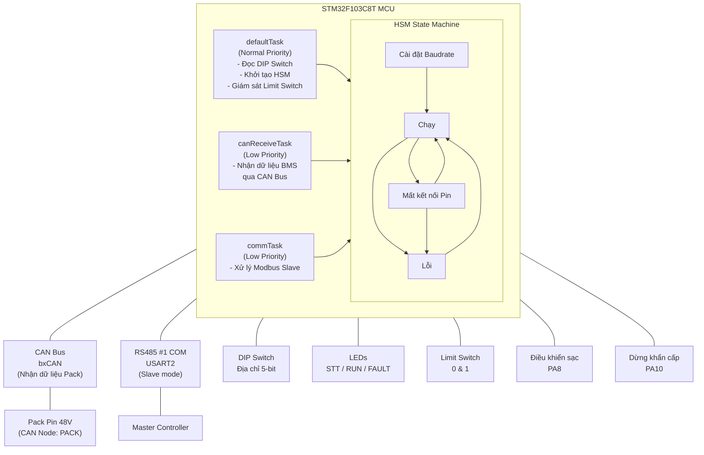

---

## 2. Sơ đồ chân GPIO

### 2a. Thay đổi so với bản RS485

| Thay đổi | Cũ (RS485) | Mới (CAN) |
|----------|------------|-----------|
| Giao tiếp Pack | USART3 (PB10-TX, PB11-RX) + RS4852_TXEN (PB12) | bxCAN (PA11-RX, PA12-TX) |
| Ngoại vi | Modbus Master qua RS485 | CAN 2.0B RX (lắng nghe thụ động) |
| Bỏ chân PB10-PB12 | RS4852_DI, RS4852_RO, RS4852_TXEN | **Không sử dụng** (có thể dùng cho mục đích khác) |

### 2b. Bảng chân GPIO đầy đủ

| Chân | Tên          | Chức năng                      | Hướng     |
|------|--------------|--------------------------------|-----------|
| PA2  | RS4851_DI    | USART2 TX (RS485 COM)          | Output    |
| PA3  | RS4851_RO    | USART2 RX (RS485 COM)          | Input     |
| PA4  | RS4851_TXEN  | RS485 #1 TX Enable             | Output    |
| PA6  | RD_VOLTAGE   | Đọc điện áp (Analog)           | Analog    |
| PA8  | CHARGE_CTRL  | Điều khiển sạc                 | Output    |
| PA10 | EMERGENCY    | Dừng khẩn cấp                  | Output    |
| **PA11** | **CAN_RX** | **CAN Nhận** | **Input** |
| **PA12** | **CAN_TX** | **CAN Phát** | **Output** |
| PB0  | ADDR4        | DIP Switch bit 0               | Input PU  |
| PB1  | ADDR3        | DIP Switch bit 1               | Input PU  |
| PB2  | ADDR2        | DIP Switch bit 2               | Input PU  |
| PB3  | ADDR1        | DIP Switch bit 3               | Input PU  |
| PB4  | ADDR0        | DIP Switch bit 4               | Input PU  |
| PB5  | LED_STT      | LED trạng thái giao tiếp       | Output    |
| PB6  | LED_RUN      | LED trạng thái hoạt động       | Output    |
| PB7  | LED_FAULT    | LED trạng thái lỗi             | Output    |
| PB8  | LIMIT_SWITCH0| Công tắc giới hạn 0            | Input PU  |
| PB9  | LIMIT_SWITCH1| Công tắc giới hạn 1            | Input PU  |

---

## 3. Lưu đồ khởi động hệ thống

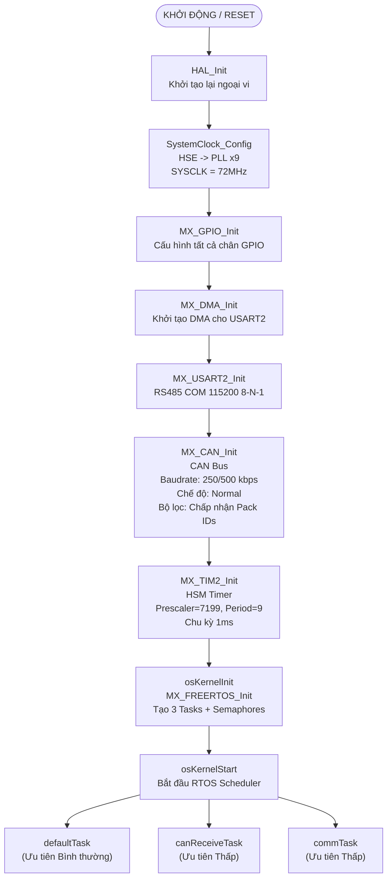

---

## 4. Lưu đồ defaultTask (Task chính)

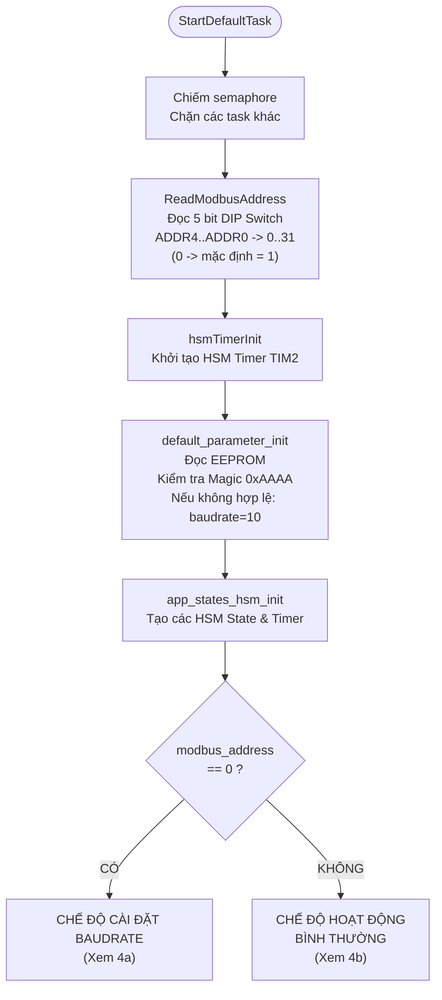

### 4a. Chế độ cài đặt Baudrate (Địa chỉ = 0) - GIỮ NGUYÊN

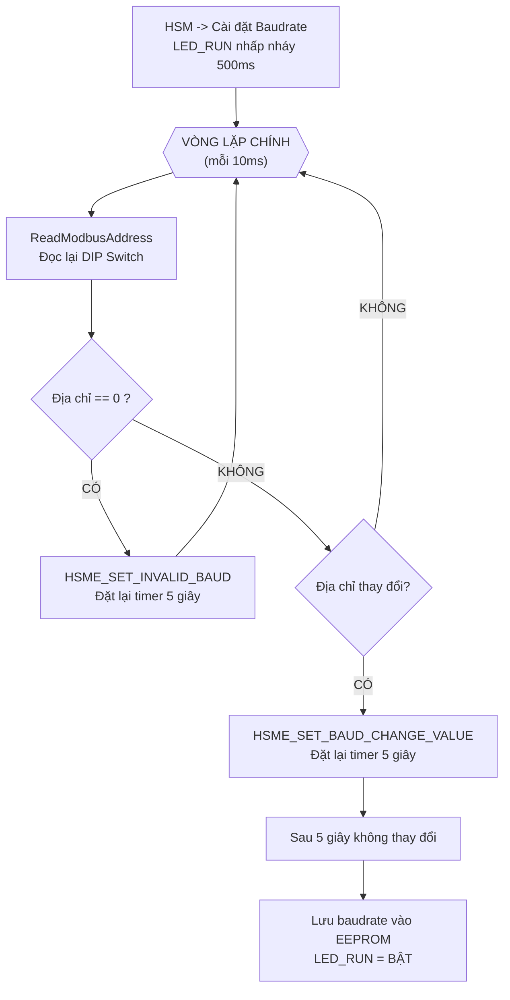

### 4b. Chế độ hoạt động bình thường (Địa chỉ != 0)

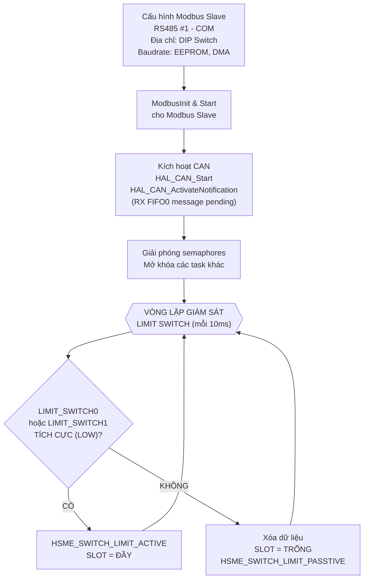

---

## 5. Lưu đồ canReceiveTask (Task đọc dữ liệu pin qua CAN)

> **THAY ĐỔI CHÍNH**: Thay vì polling Modbus Master, giờ nhận CAN message
> qua interrupt callback. Pack pin tự động broadcast dữ liệu theo chu kỳ.

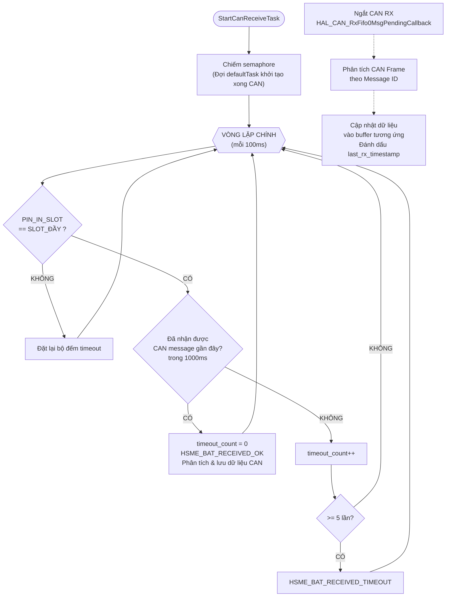

### 5a. CAN RX Callback - Phân tích CAN Message

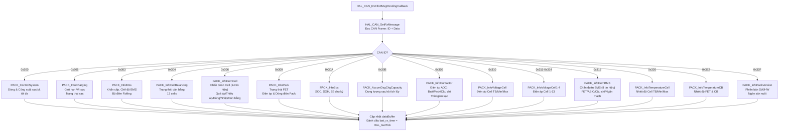

---

## 6. Lưu đồ commTask (Task giao tiếp Master) - GIỮ NGUYÊN

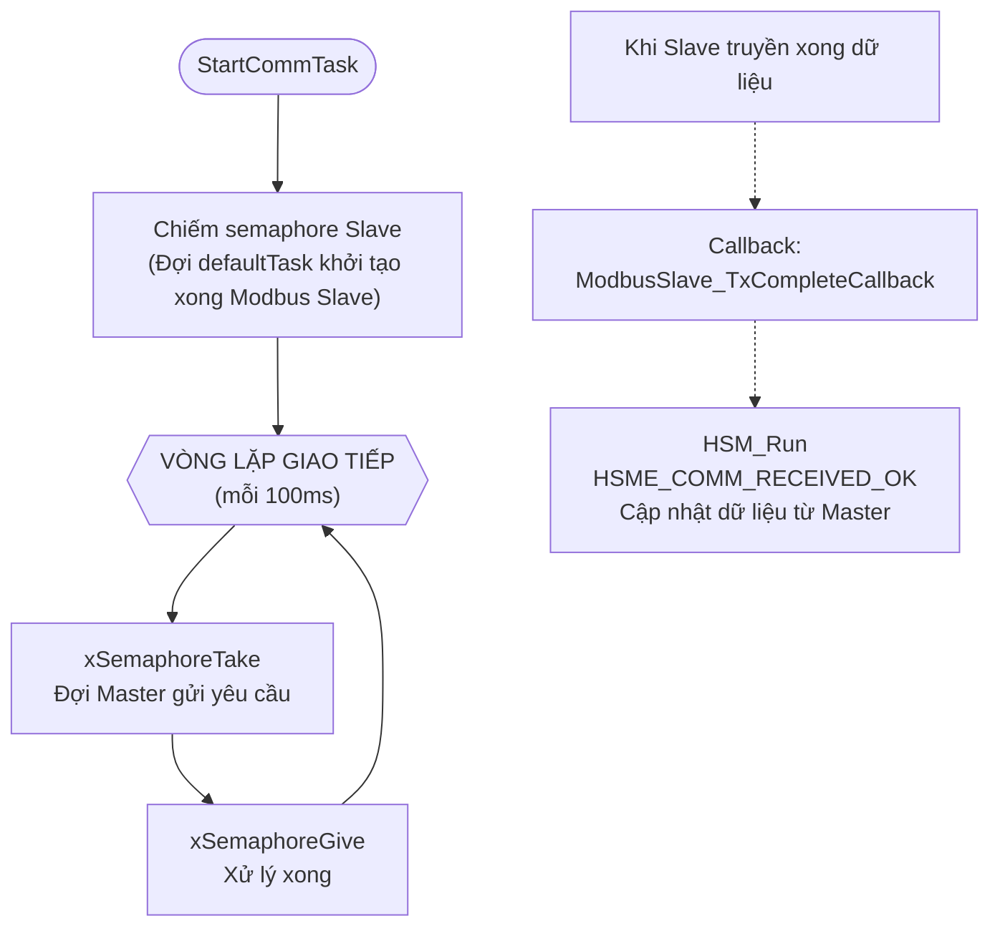

---

## 7. HSM State Machine - Sơ đồ chuyển trạng thái - GIỮ NGUYÊN

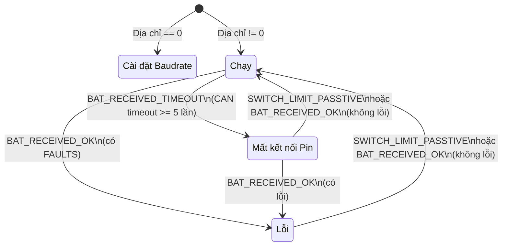

### Chi tiết từng trạng thái HSM

| Trạng thái | Entry | Init | Exit | Sự kiện xử lý |
|-------------|-------|------|------|----------------|
| **Cài đặt Baudrate** | Tắt tất cả LED | LED_RUN nhấp nháy 500ms, Bật timer 5s | Dừng tất cả timer | INVALID_BAUD → Đặt lại timer 5s, BAUD_CHANGE → Đặt lại timer 5s, SETTING_DONE → Lưu EEPROM, LED_RUN = BẬT |
| **Chạy** | LED_RUN=BẬT, LED_FAULT=TẮT, LED_STT=TẮT | EMERGENCY=TẮT, CHARGE=TẮT | - | SWITCH_LIMIT_ACTIVE → SLOT=ĐẦY, SWITCH_LIMIT_PASSTIVE → Xóa dữ liệu SLOT=TRỐNG, COMM_RECEIVED_OK → Sao chép dữ liệu, kiểm tra Emergency/Charge, nhấp nháy LED_STT 100ms |
| **Lỗi** | LED_FAULT=BẬT, LED_RUN=TẮT, LED_STT=TẮT | EMERGENCY=TẮT, CHARGE=TẮT | - | - |
| **Mất kết nối Pin** | LED_FAULT=BẬT, LED_RUN=TẮT, LED_STT=TẮT | EMERGENCY=TẮT, CHARGE=TẮT, LED_FAULT nhấp nháy 500ms | - | - |

---

## 8. Bảng trạng thái LED - GIỮ NGUYÊN

| Trạng thái        | LED_RUN         | LED_FAULT        | LED_STT                                 |
|-------------------|-----------------|------------------|------------------------------------------|
| Cài đặt Baudrate  | Nhấp nháy 500ms | TẮT              | TẮT                                     |
| Chạy (bình thường)| BẬT             | TẮT              | Nhấp nháy 100ms khi nhận dữ liệu COM   |
| Lỗi               | TẮT             | BẬT              | TẮT                                     |
| Mất kết nối Pin   | TẮT             | Nhấp nháy 500ms  | TẮT                                     |

---

## 9. Giao tiếp truyền thông

### 9a. CAN Bus (Đọc dữ liệu từ Pack Pin) - **MỚI**

| Thông số          | Giá trị                           |
|-------------------|-----------------------------------|
| Ngoại vi          | bxCAN (STM32F103)                 |
| Chân CAN TX       | PA12                              |
| Chân CAN RX       | PA11                              |
| Transceiver       | CAN Transceiver (vd: MCP2551, TJA1050) |
| Baudrate          | 250 kbps hoặc 500 kbps           |
| Chế độ            | Normal (chỉ nhận - lắng nghe thụ động) |
| Bộ lọc            | Chấp nhận Pack CAN IDs (0x300-0x32F) |
| Nhận dữ liệu     | Ngắt (RX FIFO0)                  |

### 9b. Bảng CAN Message từ Pack Pin (DBC: VMO_SinglePack_DBC_V0_1)

| CAN ID (hex) | CAN ID (dec) | Tên Message | Chu kỳ (ms) | DLC | Mô tả |
|---------------|--------------|-------------|-------------|-----|-------|
| 0x300 | 768 | PACK_ControlSystem | 150 | 8 | Dòng & công suất sạc/xả tối đa |
| 0x301 | 769 | PACK_InfoCharging | 1000 | 8 | Giới hạn V/I sạc, trạng thái sạc |
| 0x303 | 771 | PACK_InfoBms | 150 | 8 | Khẩn cấp, chế độ BMS, bộ đếm rolling |
| 0x304 | 772 | PACK_InfoCellBalancing | 1000 | 8 | Trạng thái cân bằng cell (13 cells) |
| 0x306 | 774 | PACK_InfoDemCell | 150 | 8 | Chẩn đoán cell (quá/thiếu áp, dòng, nhiệt) |
| 0x309 | 777 | PACK_InfoPack | 150 | 8 | Trạng thái FET, điện áp pack, dòng điện |
| 0x30A | 778 | PACK_InfoSox | 1000 | 8 | SOC%, SOH%, số chu kỳ, thời gian sạc còn lại |
| 0x30B | 779 | PACK_AccumDsgChgCapacity | 3000 | 8 | Dung lượng sạc/xả tích lũy |
| 0x30E | 782 | PACK_InfoContactor | 150 | 8 | Điện áp ADC (batt, cầu chì, pack), thời gian sạc |
| 0x310 | 784 | PACK_InfoVoltageCell | 500 | 8 | Điện áp cell trung bình/nhỏ nhất/lớn nhất |
| 0x311 | 785 | PACK_InfoVoltageCell1 | 500 | 8 | Điện áp Cell 1-4 |
| 0x312 | 786 | PACK_InfoVoltageCell2 | 500 | 8 | Điện áp Cell 5-8 |
| 0x313 | 787 | PACK_InfoVoltageCell3 | 500 | 8 | Điện áp Cell 9-12 |
| 0x314 | 788 | PACK_InfoVoltageCell4 | 500 | 2 | Điện áp Cell 13 |
| 0x315 | 789 | PACK_InfoDemBMS | 500 | 4 | Chẩn đoán BMS (nhiệt FET, cầu chì, ngắn mạch) |
| 0x320 | 800 | PACK_InfoTemperatureCell | 1000 | 8 | Nhiệt độ cell trung bình/nhỏ nhất/lớn nhất |
| 0x322 | 802 | PACK_InfoTemperatureCB | 500 | 8 | Nhiệt độ FET & CB |
| 0x32F | 815 | PACK_InfoPackVersion | 1000 | 8 | Phiên bản SW/HW, ngày sản xuất |

### 9c. So sánh RS485 Modbus (cũ) và CAN (mới)

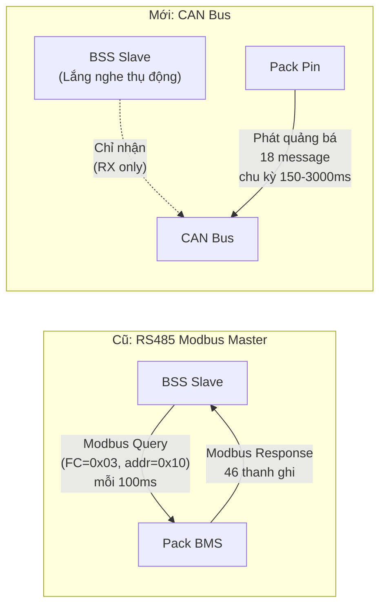

| Tiêu chí | RS485 Modbus (cũ) | CAN Bus (mới) |
|----------|-------------------|---------------|
| Cấu hình mạng | Điểm-điểm | Bus (đa nút) |
| Giao thức | Modbus RTU | CAN 2.0B |
| Hướng giao tiếp | Master polling Slave | Pack phát quảng bá, BSS lắng nghe |
| Tốc độ | 115200 bps | 250-500 kbps |
| Dữ liệu / lần | 46 thanh ghi x 16bit = 92 bytes | 18 message x 8 bytes tối đa |
| Chu kỳ | 100ms (tất cả) | 150ms - 3000ms (tùy loại) |
| Phát hiện mất kết nối | Modbus timeout (5 lần liên tiếp) | CAN RX timeout (không nhận message) |
| Ngoại vi MCU | USART3 + DMA | bxCAN |

### 9d. Modbus Slave (RS485 #1 - Giao tiếp Master Controller) - GIỮ NGUYÊN

| Thông số          | Giá trị                         |
|-------------------|---------------------------------|
| UART              | USART2 (PA2-TX, PA3-RX)        |
| Chân TX Enable    | PA4 (RS4851_TXEN)               |
| Địa chỉ Slave     | Từ DIP Switch (1-31)            |
| Baudrate          | Từ EEPROM (1200-115200)         |
| Số lượng thanh ghi | 50 (TOTAL_STA_REGISTERS)        |
| Timeout           | 1000ms                          |
| Chế độ            | DMA                             |

### 9e. Bảng mã Baudrate (cho Modbus Slave) - GIỮ NGUYÊN

| Mã  | Baudrate |
|-----|----------|
| 1   | 1200     |
| 2   | 2400     |
| 3   | 4800     |
| 4   | 9600     |
| 5   | 14400    |
| 6   | 19200    |
| 7   | 38400    |
| 8   | 56000    |
| 9   | 57600    |
| 10  | 115200   |

---

## 10. Bản đồ dữ liệu CAN -> Thanh ghi Station

### 10a. Ánh xạ CAN Signals -> Dữ liệu nội bộ (thay cho Modbus Registers)

Dữ liệu từ CAN messages sẽ được phân tích và lưu vào cấu trúc nội bộ, sau đó cung cấp cho Master Controller qua Modbus Slave.

#### PACK_InfoPack (0x309, 150ms) - Thông tin chính Pack

| Tín hiệu | Bits | Hệ số | Offset | Đơn vị | Ánh xạ sang |
|-----------|------|-------|--------|--------|-------------|
| pack_statusCFET | 4 bit | 1 | 0 | - | FET_STATUS (C-FET) |
| pack_statusDFET | 4 bit | 1 | 0 | - | FET_STATUS (D-FET) |
| pack_statusPrechargeFET | 4 bit | 1 | 0 | - | FET_STATUS (P-FET) |
| pack_statusLowCapacityAlarm | 4 bit | 1 | 0 | - | ALARM_BITS |
| pack_statusPackVoltageBAT | 16 bit | 0.002 | 0 | V | PACK_VOLT |
| pack_statusPackCurrent | 16 bit có dấu | 0.02 | 0 | A | PACK_CURRENT |
| pack_statusPackCurrentAvg | 16 bit có dấu | 0.02 | 0 | A | PACK_CURRENT_AVG |

#### PACK_InfoSox (0x30A, 1000ms) - SOC / SOH

| Tín hiệu | Bits | Hệ số | Đơn vị | Ánh xạ sang |
|-----------|------|-------|--------|-------------|
| pack_socRSOC | 8 bit | 1 | % | SOC_PERCENT |
| pack_socSOH | 8 bit | 1 | % | SOH_VALUE |
| pack_socFullChargeCapacityAh | 8 bit | 0.4 | Ah | CAPACITY |
| pack_socRemainingCapacityAh | 8 bit | 0.4 | Ah | REMAINING_CAP |
| pack_socCycleCount | 16 bit | 1 | - | CYCLE_COUNT |
| pack_socRemainingChargingTime | 16 bit | 1 | phút | REMAINING_CHG_TIME |

#### PACK_InfoVoltageCell1-4 (0x311-0x314, 500ms) - Điện áp Cell

| Tín hiệu | Hệ số | Đơn vị | Ánh xạ sang |
|-----------|-------|--------|-------------|
| pack_statusVoltageCell01..13 | 0.0001 | V | CELL1..CELL13 |

#### PACK_InfoTemperatureCell (0x320, 1000ms) - Nhiệt độ Cell

| Tín hiệu | Bits | Hệ số | Đơn vị | Ánh xạ sang |
|-----------|------|-------|--------|-------------|
| pack_statusTemperatureCellAvg | 8 bit có dấu | 1 | °C | TEMP_AVG |
| pack_statusTemperatureCellMin | 8 bit có dấu | 1 | °C | TEMP_MIN |
| pack_statusTemperatureCellMax | 8 bit có dấu | 1 | °C | TEMP_MAX |

#### PACK_InfoBms (0x303, 150ms) - Trạng thái BMS

| Tín hiệu | Mô tả | Ánh xạ sang |
|-----------|-------|-------------|
| pack_statusEmergency | Trạng thái khẩn cấp | IS_EMERGENCY (từ pack) |
| pack_statusBmsUserMode | 0=Chờ, 1=Hoạt động | BMS_STATE |
| pack_statusRollingCounter | 0-15, đếm liên tục | Dùng để phát hiện BMS còn sống |
| pack_statusIgnitionRecognition | 0=Low, 1=High | IGNITION_STATUS |
| pack_statusCurrentDirection | 0=Nghỉ, 1=Sạc, 2=Xả | CURRENT_DIRECTION |
| pack_stsDiagCellTopPriorResult | Kết quả chẩn đoán cell ưu tiên cao nhất | DIAG_CELL_TOP_PRIOR |
| pack_wakeupSource | 0=RTC, 1=BMS SW | WAKEUP_SOURCE |

#### PACK_ControlSystem (0x300, 150ms) - Điều khiển hệ thống

| Tín hiệu | Bits | Hệ số | Offset | Đơn vị | Dải giá trị | Ánh xạ sang |
|-----------|------|-------|--------|--------|-------------|-------------|
| pack_controlSysMaxChgCurrent | 16 bit có dấu | 0.02 | 0 | A | -655 ~ 655 | MAX_CHG_CURRENT |
| pack_controlSysMaxDsgCurrent | 16 bit có dấu | 0.02 | 0 | A | -655 ~ 655 | MAX_DSG_CURRENT |
| pack_controlSysMaxChgPower | 16 bit có dấu | 1 | 0 | W | -32767 ~ 32767 | MAX_CHG_POWER |
| pack_controlSysMaxDsgPower | 16 bit có dấu | 1 | 0 | W | -32767 ~ 32767 | MAX_DSG_POWER |

#### PACK_InfoCharging (0x301, 1000ms) - Thông tin sạc

| Tín hiệu | Bits | Hệ số | Offset | Đơn vị | Dải giá trị | Ánh xạ sang |
|-----------|------|-------|--------|--------|-------------|-------------|
| pack_chargingVoltageLimit | 16 bit | 0.002 | 0 | V | 0 ~ 131.07 | CHG_VOLTAGE_LIMIT |
| pack_chargingCurrentLimit | 16 bit có dấu | 0.02 | 0 | A | -655 ~ 655 | CHG_CURRENT_LIMIT |
| pack_chargingFullyChargedSts | 4 bit | 1 | 0 | - | 0=N/A, 1=Đang sạc, 2=Đầy | CHG_FULLY_STATUS |
| pack_controlModeCharger | 4 bit | 1 | 0 | - | 0=Tắt, 1=Sạc thường, 2=Trickle | CHG_MODE |
| pack_endCurrentCharge | 8 bit | 0.01 | 0 | A | 0 ~ 2.55 | CHG_END_CURRENT |
| pack_trickleCurrentCharger | 8 bit | 0.01 | 0 | A | 0 ~ 2.55 | CHG_TRICKLE_CURRENT |
| pack_chargingDiagCharger | 8 bit | 1 | 0 | - | 0 ~ 255 | CHG_DIAG |

#### PACK_InfoCellBalancing (0x304, 1000ms) - Trạng thái cân bằng cell

| Tín hiệu | Bits | Hệ số | Đơn vị | Giá trị | Ánh xạ sang |
|-----------|------|-------|--------|---------|-------------|
| pack_statusCB01 | 4 bit | 1 | - | 0=Tắt, 1=Bật | CB_STATUS_CELL01 |
| pack_statusCB02 | 4 bit | 1 | - | 0=Tắt, 1=Bật | CB_STATUS_CELL02 |
| pack_statusCB03 | 4 bit | 1 | - | 0=Tắt, 1=Bật | CB_STATUS_CELL03 |
| pack_statusCB04 | 4 bit | 1 | - | 0=Tắt, 1=Bật | CB_STATUS_CELL04 |
| pack_statusCB05 | 4 bit | 1 | - | 0=Tắt, 1=Bật | CB_STATUS_CELL05 |
| pack_statusCB06 | 4 bit | 1 | - | 0=Tắt, 1=Bật | CB_STATUS_CELL06 |
| pack_statusCB07 | 4 bit | 1 | - | 0=Tắt, 1=Bật | CB_STATUS_CELL07 |
| pack_statusCB08 | 4 bit | 1 | - | 0=Tắt, 1=Bật | CB_STATUS_CELL08 |
| pack_statusCB09 | 4 bit | 1 | - | 0=Tắt, 1=Bật | CB_STATUS_CELL09 |
| pack_statusCB10 | 4 bit | 1 | - | 0=Tắt, 1=Bật | CB_STATUS_CELL10 |
| pack_statusCB11 | 4 bit | 1 | - | 0=Tắt, 1=Bật | CB_STATUS_CELL11 |
| pack_statusCB12 | 4 bit | 1 | - | 0=Tắt, 1=Bật | CB_STATUS_CELL12 |
| pack_statusCB13 | 4 bit | 1 | - | 0=Tắt, 1=Bật | CB_STATUS_CELL13 |

#### PACK_InfoDemCell (0x306, 150ms) - Chẩn đoán Cell - BỔ SUNG ĐẦY ĐỦ

| Tín hiệu | Bits | Mô tả | Mức cảnh báo | Ánh xạ sang |
|-----------|------|-------|-------------|-------------|
| pack_demOverVoltageCell | 4 bit | Quá áp cell | 0=Bình thường, 1=Cảnh báo 1, 2=Cảnh báo 2, 3=Lỗi, 4=Hỏng | DEM_OV_CELL |
| pack_demOverVoltagePack | 4 bit | Quá áp pack | 0=Bình thường ... 4=Hỏng | DEM_OV_PACK |
| pack_demUnderVoltageCell | 4 bit | Thiếu áp cell | 0=Bình thường ... 4=Hỏng | DEM_UV_CELL |
| pack_demUnderVoltagePack | 4 bit | Thiếu áp pack | 0=Bình thường ... 4=Hỏng | DEM_UV_PACK |
| pack_demOverCurrentChg | 4 bit | Quá dòng sạc | 0=Bình thường ... 4=Hỏng | DEM_OC_CHG |
| pack_demOverCurrentDis | 4 bit | Quá dòng xả | 0=Bình thường ... 4=Hỏng | DEM_OC_DIS |
| pack_demOverTemperatureChg | 4 bit | Quá nhiệt sạc | 0=Bình thường ... 4=Hỏng | DEM_OT_CHG |
| pack_demOverTemperatureDis | 4 bit | Quá nhiệt xả | 0=Bình thường ... 4=Hỏng | DEM_OT_DIS |
| pack_demUnderTemperatureChg | 4 bit | Dưới nhiệt sạc | 0=Bình thường ... 4=Hỏng | DEM_UT_CHG |
| pack_demUnderTemperatureDis | 4 bit | Dưới nhiệt xả | 0=Bình thường ... 4=Hỏng | DEM_UT_DIS |
| pack_demImbCellChg | 4 bit | Mất cân bằng cell khi sạc | 0=Bình thường ... 4=Hỏng | DEM_IMB_CHG |
| pack_demImbCellRest | 4 bit | Mất cân bằng cell khi nghỉ | 0=Bình thường ... 4=Hỏng | DEM_IMB_REST |
| pack_demImbCellTemperature | 4 bit | Mất cân bằng nhiệt độ cell | 0=Bình thường ... 4=Hỏng | DEM_IMB_TEMP |
| pack_demImbCellSOC | 4 bit | Mất cân bằng SOC cell | 0=Bình thường ... 4=Hỏng | DEM_IMB_SOC |

> **Lưu ý**: Bất kỳ tín hiệu nào có giá trị >= 3 (Lỗi) hoặc >= 4 (Hỏng) sẽ kích hoạt chuyển trạng thái HSM sang **LỖI**.

#### PACK_InfoVoltageCell (0x310, 500ms) - Thống kê điện áp Cell

| Tín hiệu | Bits | Hệ số | Đơn vị | Dải giá trị | Ánh xạ sang |
|-----------|------|-------|--------|-------------|-------------|
| pack_statusVoltageCellAvg | 16 bit | 0.0001 | V | 0 ~ 6.5535 | VCELL_AVG |
| pack_statusVoltageCellMin | 16 bit | 0.0001 | V | 0 ~ 6.5535 | VCELL_MIN |
| pack_statusVoltageCellMinNo | 8 bit | 1 | Bank | 0 ~ 255 | VCELL_MIN_NO |
| pack_statusVoltageCellMax | 16 bit | 0.0001 | V | 0 ~ 6.5535 | VCELL_MAX |
| pack_statusVoltageCellMaxNo | 8 bit | 1 | Bank | 0 ~ 255 | VCELL_MAX_NO |

#### PACK_InfoDemBMS (0x315, 500ms) - Chẩn đoán BMS

| Tín hiệu | Bits | Mô tả | Giá trị | Ánh xạ sang |
|-----------|------|-------|---------|-------------|
| pack_demBMSCFET | 4 bit | Chẩn đoán C-FET | 0=Bình thường, 3=Lỗi | DEM_BMS_CFET |
| pack_demBMSDFET | 4 bit | Chẩn đoán D-FET | 0=Bình thường, 3=Lỗi | DEM_BMS_DFET |
| pack_demBMSPFET | 4 bit | Chẩn đoán P-FET | 0=Bình thường, 3=Lỗi | DEM_BMS_PFET |
| pack_demBMSASICComm | 4 bit | Lỗi giao tiếp ASIC | 0=Bình thường, 3=Lỗi | DEM_BMS_ASIC_COMM |
| pack_demBMSASICShutdown | 4 bit | ASIC tắt bất thường | 0=Bình thường, 3=Lỗi | DEM_BMS_ASIC_SHUTDOWN |
| pack_demBMSShortCurrent | 4 bit | Ngắn mạch ASIC | 0=Bình thường, 3=Lỗi | DEM_BMS_SHORT |
| pack_demBMSFETTemperature | 4 bit | Quá nhiệt FET | 0=Bình thường, 3=Lỗi | DEM_BMS_FET_TEMP |
| pack_demBMSFuseBlow | 4 bit | Cầu chì nổ | 0=Bình thường, 3=Lỗi | DEM_BMS_FUSE |

#### PACK_InfoContactor (0x30E, 150ms) - Thông tin Contactor & ADC

| Tín hiệu | Bits | Hệ số | Offset | Đơn vị | Dải giá trị | Ánh xạ sang |
|-----------|------|-------|--------|--------|-------------|-------------|
| pack_statusAdcBattVolt | 16 bit | 0.002 | 0 | V | 0 ~ 131.07 | ADC_BATT_VOLT |
| pack_statusAdcPackVolt | 16 bit | 0.002 | 0 | V | 0 ~ 131.07 | ADC_PACK_VOLT |
| pack_statusAdcFuseVolt | 16 bit | 0.002 | 0 | V | 0 ~ 131.07 | ADC_FUSE_VOLT |
| pack_statuschargetime | 16 bit | 1 | 0 | - | 0 ~ 65535 | CHARGE_TIME |

#### PACK_InfoAccumDsgChgCapacity (0x30B, 3000ms) - Dung lượng sạc/xả tích lũy

| Tín hiệu | Bits | Hệ số | Offset | Đơn vị | Dải giá trị | Ánh xạ sang |
|-----------|------|-------|--------|--------|-------------|-------------|
| pack_AccumChargeCapacityAh | 32 bit | 1 | 0 | Ah | 0 ~ 4294967295 | ACCUM_CHG_CAP |
| pack_AccumDischargeCapacityAh | 32 bit | 1 | 0 | Ah | 0 ~ 4294967295 | ACCUM_DSG_CAP |

#### PACK_InfoTemperatureCB (0x322, 500ms) - Nhiệt độ FET & mạch cân bằng

| Tín hiệu | Bits | Hệ số | Đơn vị | Dải giá trị | Ánh xạ sang |
|-----------|------|-------|--------|-------------|-------------|
| pack_statusTemperatureCB1 | 8 bit có dấu | 1 | °C | -127 ~ 127 | TEMP_CB1 |
| pack_statusTemperatureCB2 | 8 bit có dấu | 1 | °C | -127 ~ 127 | TEMP_CB2 |
| pack_statusTemperatureFET | 8 bit có dấu | 1 | °C | -127 ~ 127 | TEMP_FET |

#### PACK_InfoPackVersion (0x32F, 1000ms) - Phiên bản phần mềm/phần cứng

| Tín hiệu | Bits | Hệ số | Đơn vị | Ánh xạ sang |
|-----------|------|-------|--------|-------------|
| pack_versionSoftwareMajor | 4 bit | 1 | - | SW_VERSION_MAJOR |
| pack_versionSoftwareMinor | 4 bit | 1 | - | SW_VERSION_MINOR |
| pack_versionSoftwareSubminor | 4 bit | 1 | - | SW_VERSION_SUB |
| pack_versionBootloaderMajor | 4 bit | 1 | - | BL_VERSION_MAJOR |
| pack_versionBootloaderMinor | 4 bit | 1 | - | BL_VERSION_MINOR |
| pack_versionBootloaderSubminor | 4 bit | 1 | - | BL_VERSION_SUB |
| pack_versionHardwareMajor | 4 bit | 1 | - | HW_VERSION_MAJOR |
| pack_versionManufacturerDate | 16 bit | 1 | - | MFG_DATE |
| pack_OtpBq | 16 bit | 1 | - | OTP_BQ |

### 10b. Thanh ghi Station (Cung cấp cho Master Controller) - GIỮ NGUYÊN CẤU TRÚC

Bao gồm dữ liệu đã phân tích từ CAN + 4 thanh ghi bổ sung:

| Chỉ số | Tên                  | Mô tả                            |
|--------|----------------------|----------------------------------|
| 46     | IS_PIN_IN_SLOT       | Pin trong slot (0=TRỐNG, 1=ĐẦY) |
| 47     | IS_PIN_TIMEOUT       | Timeout CAN (0/1)                |
| 48     | IS_EMERGENCY_STOP    | Lệnh dừng khẩn cấp (từ Master)  |
| 49     | CHRG_CTRL            | Lệnh điều khiển sạc (từ Master)  |

---

## 11. EEPROM Storage - GIỮ NGUYÊN

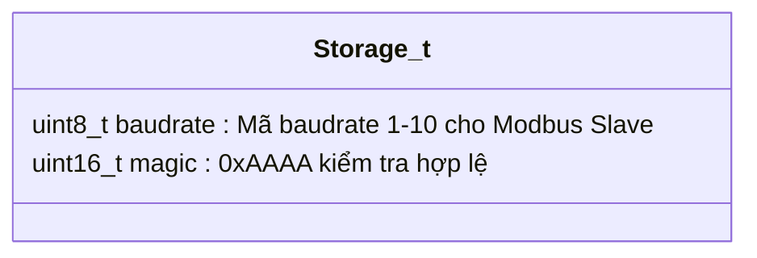

- Khi khởi động, kiểm tra `magic == 0xAAAA`
- Nếu không hợp lệ: đặt baudrate = 10 (115200), ghi EEPROM
- EEPROM chỉ lưu baudrate cho **Modbus Slave** (RS485 COM), không liên quan CAN

---

## 12. Lưu đồ xử lý sự kiện Emergency và Charge - GIỮ NGUYÊN

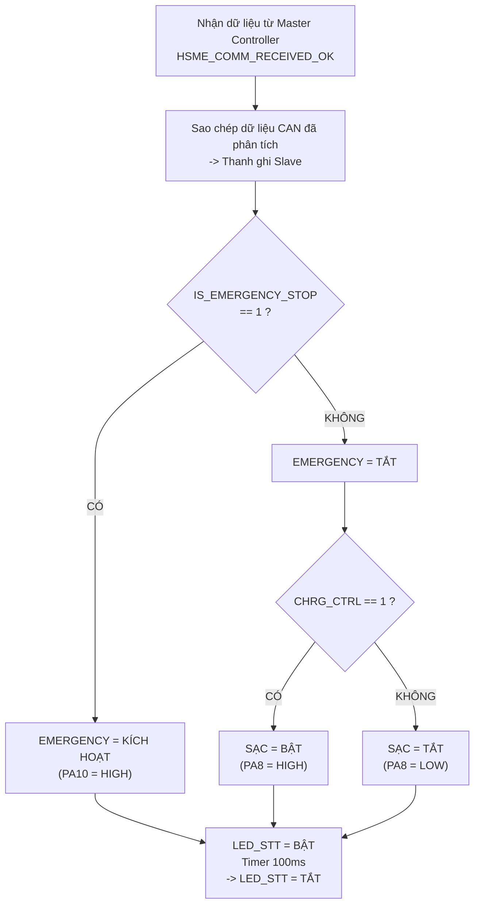

---

## 13. Lưu đồ đọc địa chỉ Modbus từ DIP Switch - GIỮ NGUYÊN

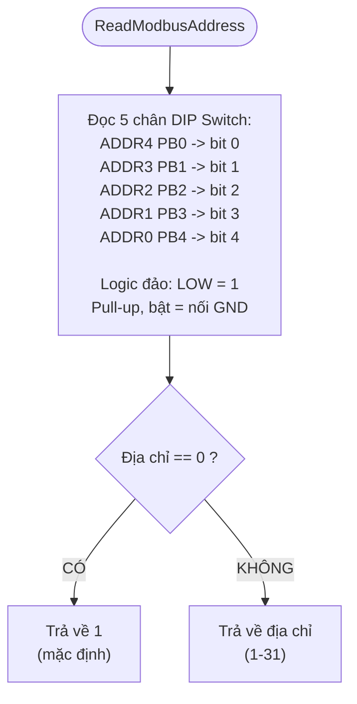

---

## 14. Cấu hình Timer

| Timer | Chức năng            | Prescaler | Period | Tần số     |
|-------|----------------------|-----------|--------|------------|
| TIM1  | HAL Tick (SysTick)   | -         | -      | 1ms        |
| TIM2  | HSM Timer            | 7199      | 9      | 1ms (1kHz) |

### HSM Software Timers - GIỮ NGUYÊN

| Timer                  | Kiểu    | Chu kỳ | Chức năng                          |
|------------------------|---------|--------|-------------------------------------|
| tCustom                | Periodic| 500ms  | Nhấp nháy LED (Setting/MatKetNoi)  |
| tTurnOffLEDStt         | Once    | 100ms  | Tắt LED_STT sau khi nháy           |
| tSettingDone           | Once    | 5000ms | Hoàn tất cài đặt baudrate          |

---

## 15. Cấu hình bộ lọc CAN (Mới)

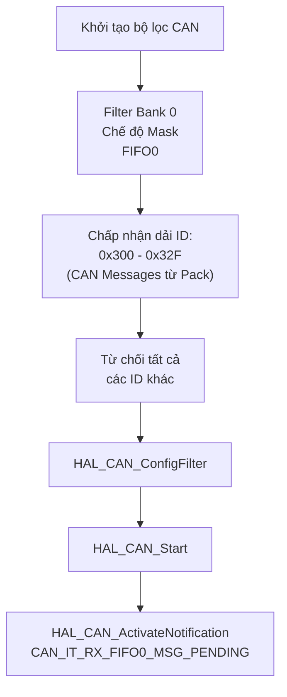

### Thông số khởi tạo CAN

| Thông số | Giá trị |
|----------|---------|
| Prescaler | 9 (với 72MHz APB1 -> 500kbps) hoặc 18 (250kbps) |
| Mode | CAN_MODE_NORMAL |
| SJW | CAN_SJW_1TQ |
| BS1 | CAN_BS1_13TQ |
| BS2 | CAN_BS2_2TQ |
| TTCM | TẮT |
| ABOM | BẬT (Tự động quản lý Bus-Off) |
| AWUM | BẬT (Tự động đánh thức) |
| NART | TẮT (Tự động truyền lại) |
| RFLM | TẮT |
| TXFP | TẮT |
